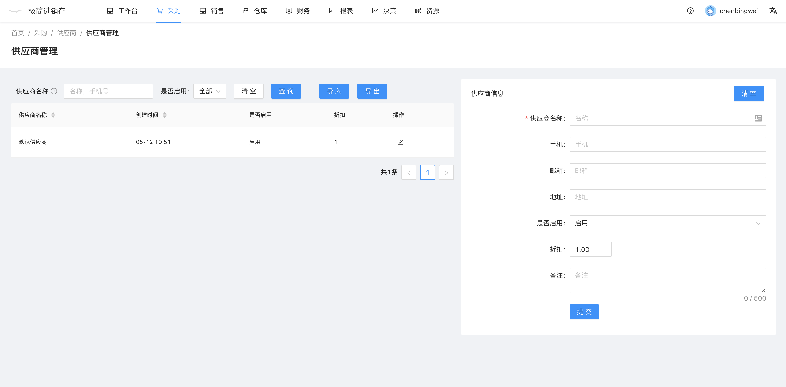

# 供应商管理
`前往方式` 导航栏点击 资源 -- 用户 -- 供应商管理

`功能`  供应商列表，新增供应商，查询供应商，导出供应商，导入供应商

### 新增供应商
页面右侧的表单中，填写供应商名称，其他相关资料，设置供应商折扣，点击提交。

## 批量导入供应商
供应商导入方法与商品导入相同，具体步骤可参照 [批量导入商品](pages/批量导入商品.md)

### 停用供应商
供应商被停用后，在采购单将无法选择该供应商。
