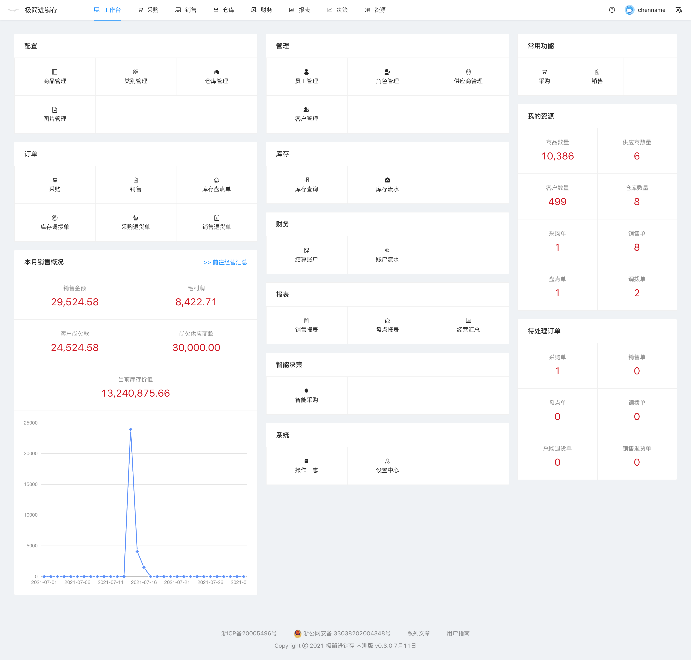

# 功能介绍

- 工作台
- 商品：商品管理，类别管理，图片管理
- 仓库：仓库管理，库存查询，库存流水，库存盘点单，库存调拨单
- 销售：销售单，销售退货单，客户管理
- 采购：采购单，采购退货单，供应商管理， 智能采购单
- 财务：结算账户，账户流水
- 系统：员工管理，角色管理，操作日志，个人设置，公司设置，打印设置
- 分析：销售报表，盘点报表，经营汇总

以下大致介绍各模块具体功能

#### 工作台
- 分类导航：左侧区域，用于快速查找功能，点击对应模块前往相应功能页面
- 常用功能：右上角区域，一些常用的功能。
- 我的资源：右下角区域，显示资源数量，点击前往对应资源。

#### 商品管理
商品列表，商品查询，商品新增，商品多规格批量新增，商品导入，商品导出，商品编辑，商品添加图片。

#### 类别管理
对商品进行分类。
类别列表，类别查询，新增类别。

#### 仓库管理
仓库列表，新增仓库，仓库查询。

#### 图片管理
图片列表，新增图片，图片查询。

#### 员工管理
员工列表，新增员工，员工查询，员工配置角色。

#### 角色管理
角色列表，系统默认角色，新增角色，修改角色权限

#### 供应商管理
供应商列表，新增供应商，编辑供应商，设置供应商折扣，导出供应商，导入供应商

#### 客户管理
客户列表，新增客户，编辑客户，设置客户折扣，导出客户，导入客户

#### 采购单
采购单列表，采购单查询，新增采购单，采购单批量添加商品，采购单存入草稿，采购单入库，撤销采购单

#### 结算账户
结算账户列表，新增结算账户

#### 账户流水
账户流水列表，账户流水查询，新增客户对账，新增记账，应收应付统计

#### 库存查询
库存记录列表，合并仓库库存记录，库存查询，库存盘点

#### 库存流水
库存流水列表，库存流水查询

#### 智能采购
智能采购单列表，新增智能采购单，选择条目生成采购单

#### 操作日志
日志列表，日志查询

#### 设置中心
个人信息，个人配置，公司信息，公司配置，打印配置

#### 销售报表
销售额，销售毛利润，销售明细的展示

#### 盘点报表
盘点盈亏金额，盘点明细的展示

#### 经营汇总
分为看板和分析两个模块，看板是重要的指标，分析以时间维度查看各项数据。
