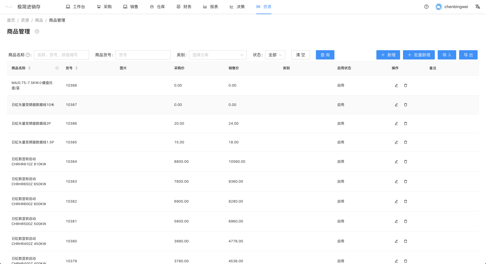
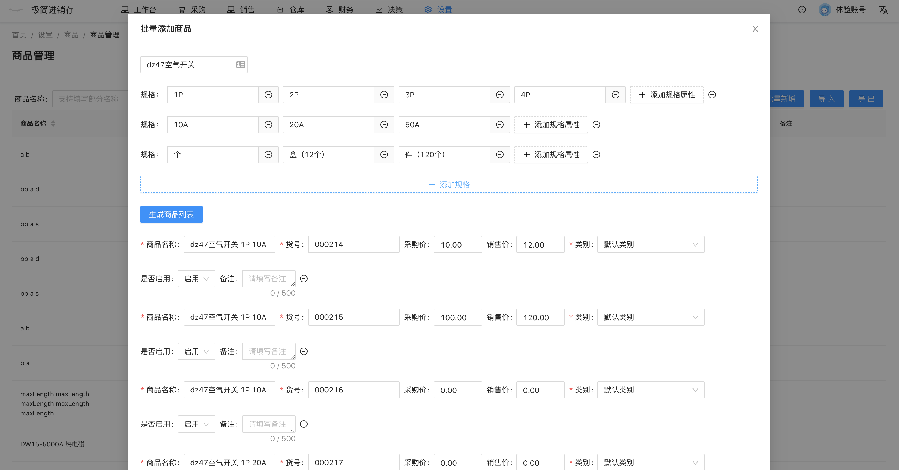
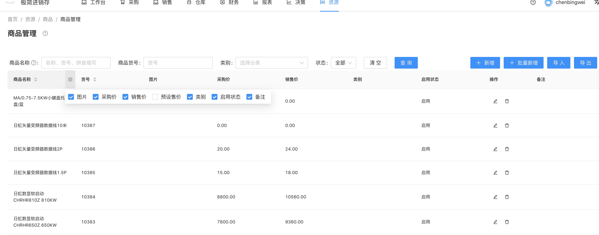

# 商品管理
`前往方式` 在导航栏点击 资源 -- 商品 -- 商品管理
`功能` 商品列表，商品查询，商品新增，商品多规格批量新增，商品导入，商品导出，商品编辑，商品添加图片

#### 商品多规格批量新增
如果用户要添加同一类商品但包含不同规格，可以使用批量新增的功能。

例如：要添加dz47空气开关 1p 2p 3p 10A 20A 30A 1个 1盒， 我们需要添加 3×3×2=18个商品，
使用批量新增可一次性添加。

1. 点击右上角`批量新增`按钮，打开批量新增弹窗。
2. 输入商品名称 `dz47空气开关`
3. 在规格属性中填写`规格属性`
4. 点击`生成商品列表`
5. 填写每个商品的`采购价`，`销售价`
6. `提交`，生成多个商品

#### 停用商品
编辑商品，将商品的是否启用改为无效，停用后的商品在开单时将无法被选择。

<!--（除商品管理外所有可以选择商品的位置）。-->

#### 商品信息展示设置
点击商品表格左上方分配置按钮，勾选需要展示的商品信息。（可以将敏感信息隐藏，如采购价）

