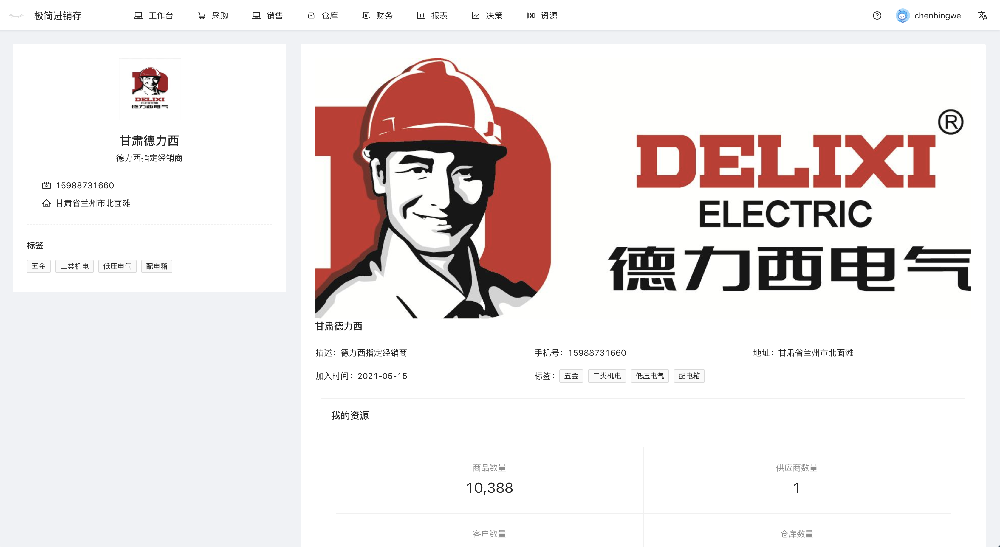
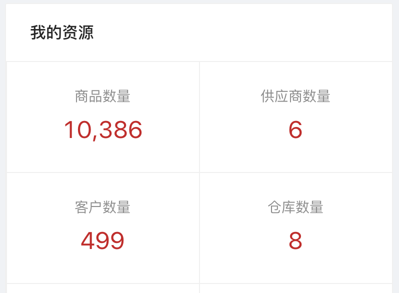
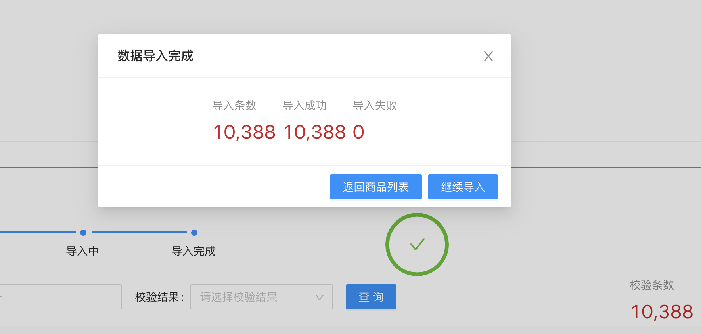
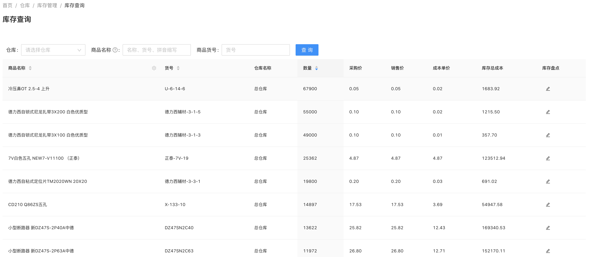

# 客户案例
案例全流程地介绍了本系统在特定领域的使用情况，供大家参考分析。

虚拟角色
- 老板陈
- 店长王
- 开单员刘
- 库管员张

### 甘肃德力西电气
甘肃德力西电气是一家二类电气经销商，从事低压电气的批发行业。 

有商品类目10000多条，维系客户数量2000余条，多个仓库门店，10余名员工。

#### 1. 第一天 注册账号，基本资料填写
老板陈在网站注册，填写了自己的相关资料和公司的相关资料，并将公司主页发布到圈子。

#### 2. 第二天 基本资料配置
老板陈添加了店长王、开单员刘、库管员张等员工，配置其用户名及初始密码，并为他们选择对应角色（管理员，销售员，仓库管理员）。

老板陈从之前使用的软件中导出客户信息，通过客户导入模块，将客户导入进系统。
老板陈用相同的方式将供应商导入系统。

老板陈在仓库管理模块，录入几个仓库与门店信息。
老板陈在结算账户模块，录入几张银行卡信息作为结算账户。

#### 3. 第三天 期初建库
老板陈从之前使用的软件中导出商品EXCEL，包含商品的名称，商品的采购价，销售价。
由于条目有10000多条，故采用表格导入的方式录入系统。 具体操作参照商品批量导入视频。

商品导入后需要建立期初库存，老板陈从之前使用的软件中将各个仓库的库存信息导出，包含商品货号，库存数量，库存成本单价。
通过期初库存盘点模块，选择对应仓库，从表格导入库存信息。

老板陈通过经营汇总，查看库存总价值。

老板陈通过记账，为结算账户设置期初余额，通过客户对账，为欠款客户设置期初应收款项，通过供应商对账，为供应商设置期初应付款项。

至此，系统建立完成，可以开账使用了。

#### 4. 第四天 - 第三十天 日常经营
老板陈通知员工使用其用户名和初始密码登录系统。
（员工登录后修改密码，并绑定自己手机号，手机号可用于登录）

每位员工配置自己相关的打印模板。

开单员刘通过销售单模块进行销售开单。

店长王根据销售情况，定期开采购单补货。

库管员张将自己仓库的待处理草稿单打印，配货后出库。

#### 5. 第三十一天 经营分析
老板陈通过经营汇总，盘点报表，销售报表查看当月经营状况。

