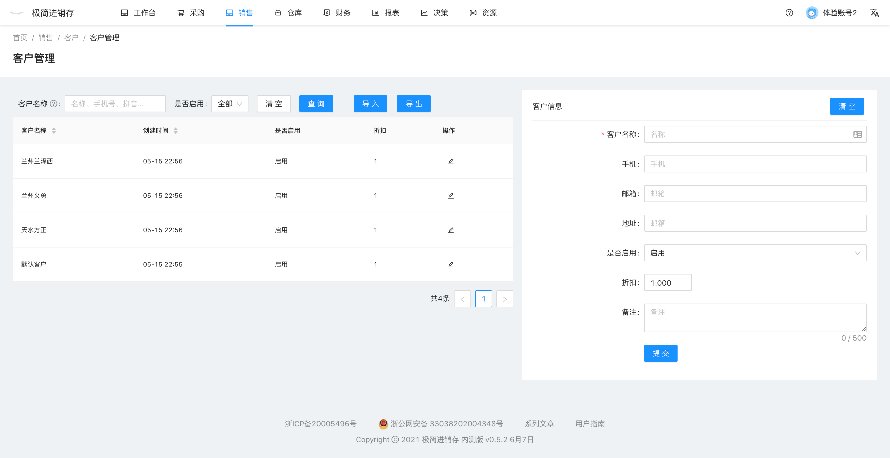

# 客户管理
`前往方式` 导航栏点击 资源 -- 用户 -- 客户管理

`功能` 客户列表，新增客户，查询客户，导入客户，导出客户。

### 新增客户
页面右侧的表单中，填写客户名称，其他相关资料，设置客户折扣，点击提交。

### 批量导入客户
[批量导入客户](pages/批量导入客户.md)

### 停用客户
客户被停用后，在销售单将无法选择该客户。

<!--
操作步骤同供应商管理，参见[供应商管理](pages/供应商管理.md)

