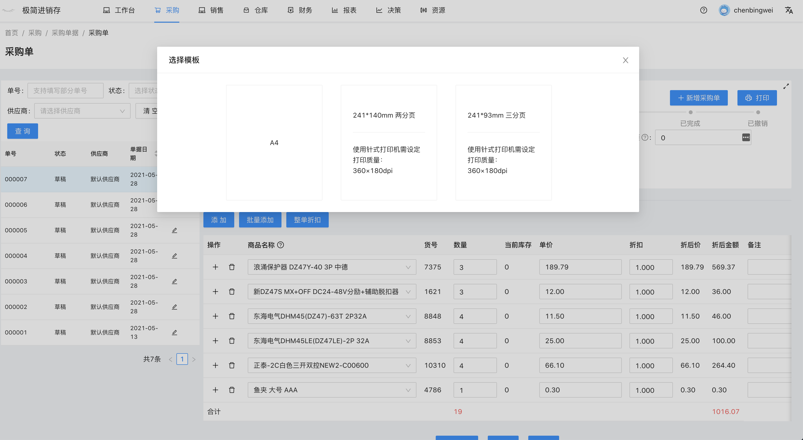
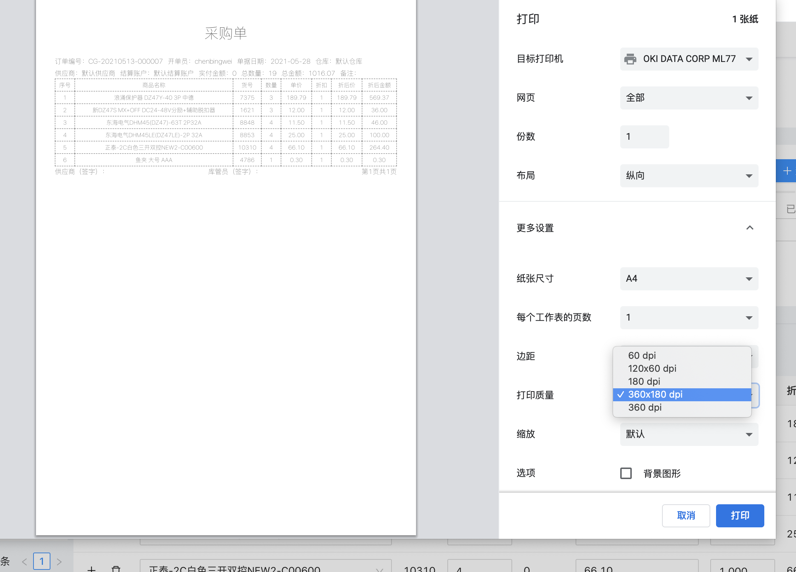
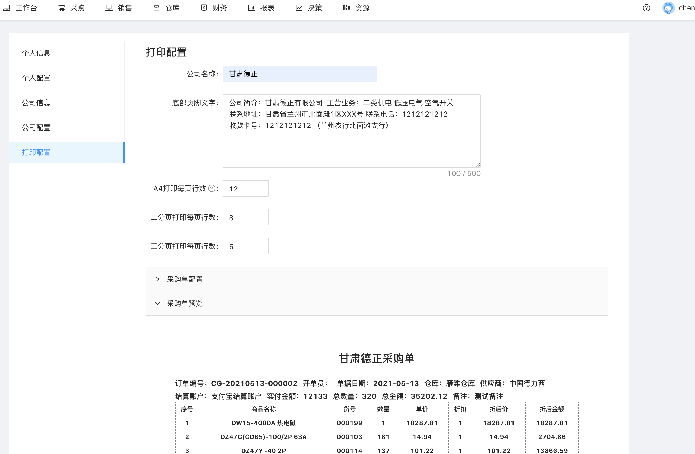
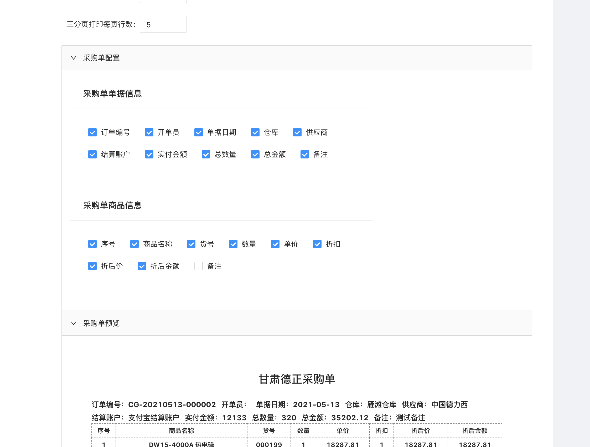

# 打印

#### 打印单据

所有单据都可以打印，选择采购单，点击右上角打印按钮，弹出打印选项。

我们提供了3种打印方式：
- A4打印
- 针式打印机两分页打印
- 针式打印机三分页打印。

选择对应打印方式，进入打印预览。

#### 针式打印机 （浏览器打印设置）

首次使用针式打印机时，需要设定打印质量 360×180dpi

#### 打印配置
打印的页头，表格，页脚都可以自定义配置，前往 设置中心 --- 打印配置。

统一的打印打印配置有：
1. 公司名称
2. 底部页脚文字
3. A4打印每页行数
4. 二分页打印每页行数
5. 三分页打印每页行数

每种单据可以设定自己需要展示的单据信息和商品信息。

