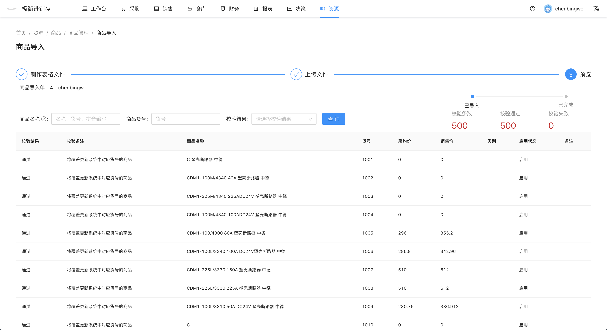
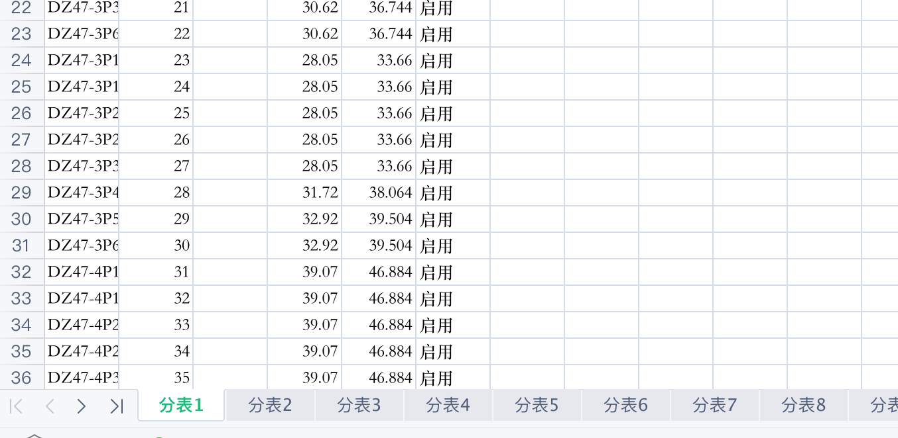
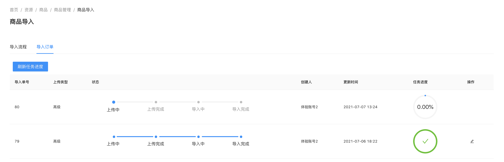
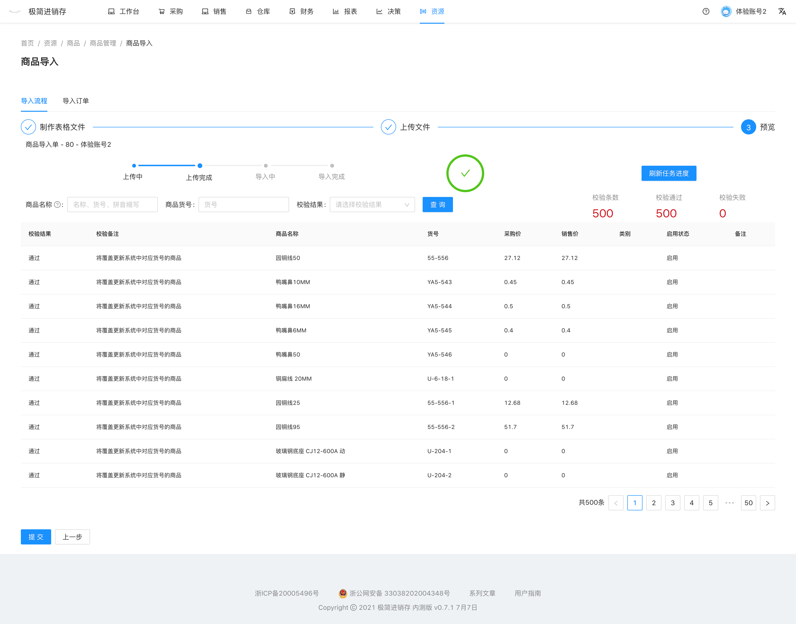
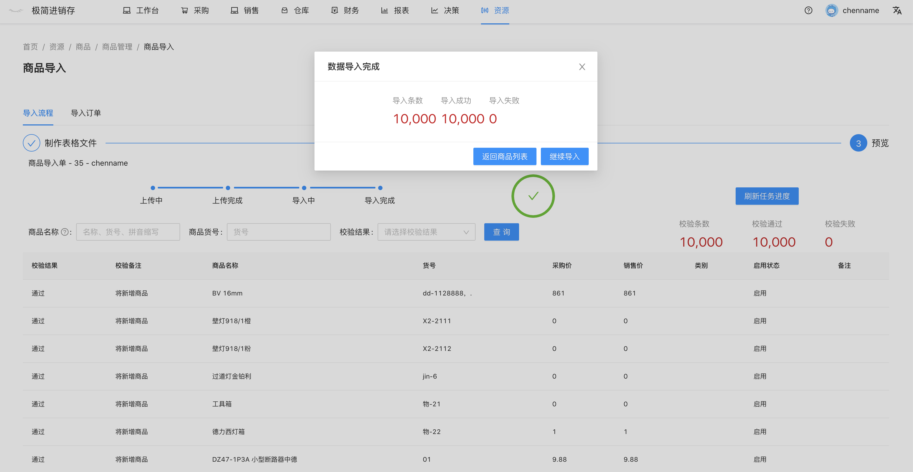

# 批量导入商品
当商品种类过多，采用逐个输入的方法费时费力，可以使用excel表格导入的方法。

`前往方式`  导航栏点击 资源 -- 商品 -- 商品管理 -- 导入

- 制作EXCEL表格文件
- 上传文件
- 检查并提交

#### 1 .制作EXCEL表格文件
如果是新增商品，下载新增模板。

如果是修改系统内商品属性，下载更新模板。

获得EXCEL模板`商品导入模板.xlsx`后，将商品数据填入表格，保存。

点击下一步。

#### 2. 上传文件
点击选择文件， 选择保存好的EXCEL模板`商品导入模板.xlsx`，待上传完成，自动进入预览页面。

#### 3. 检查并提交
检查导入预览信息，查看是否有校验失败条目，检查完成后点击提交，待提交完成后，显示成功导入条数。

### 其他注意事项
##### 1. 货号
商品货号需要唯一，批量导入商品时需要用户自己按规则生成唯一的货号。

##### 2. 商品数据超过500条
如果商品数据大于500条，需要分批上传。

1. 用户先使用新增模板，制作EXCEL表格文件
2. 在第一步里，点击转换大文件，将保存好的EXCEL模板`商品导入模板.xlsx`上传，
3. 上传完成后，将获得新的EXCEL模板`商品导入模板（分表）.xlsx`。
4. `商品导入模板（分表）`包含多张sheet，排序最靠前的工作表`分表1`将会被使用，更改工作表`分表1`排序，依次上传文件。

例如：第一次 `分表1` 在首位，上传将导入序列为1-500的商品，第二次移动 `分表2` 到首位，
上传将导入序列为501-1000的商品。

可前往视频专区查看商品导入视频

# 高级导入
- 用户可使用高级导入一次性导入20000条数据
- 现阶段高级导入功能免费开发，由于高级导入功能消耗资源，未来将只对会员用户开发
- 高级导入10000条需要运行10-30分钟，导入过程将影响系统查询速度，建议在晚上或早上空闲时间使用

`使用场景` 期初商品录入，年末商品价格批量修改。

`前往方式` 导航栏点击 资源 -- 商品 -- 商品管理 -- 导入

制作好导入文件后，进入第二步上传文件，选择高级上传。

上传完成后自动跳转至导入订单，第一条就是最新生成的导入订单，上传类型为高级，状态为上传中。
点击刷新任务进度，当任务进度为`100%`时，状态变成上传完成，出现编辑按钮，点击进入订单预览页面。

检查导入预览信息，查看是否有校验失败条目，检查完成后点击提交。 点击顶部 `刷新任务进度`，任务状态成为导入中。

当任务进度为`100%`时，状态变成导入完成，跳出弹窗，显示导入成功条数，本次导入完成。

