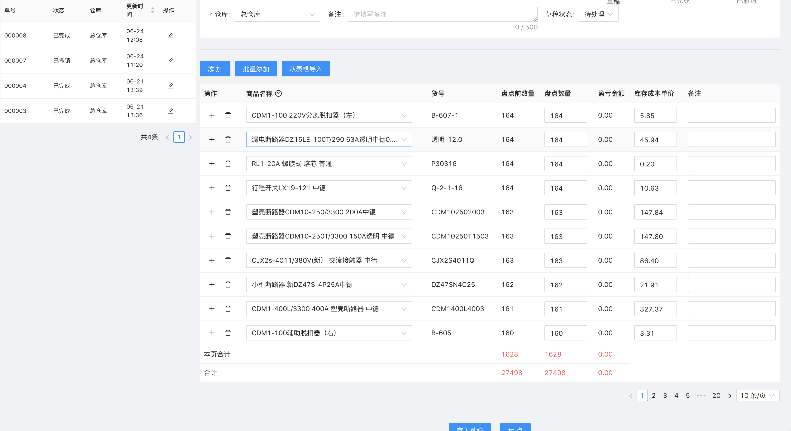

## 期初库存录入
期初的库存需要设置库存成本单价，故使用期初盘点单录入库存。

`前往方式`  导航栏点击 仓库 -- 库存单据 -- 期初库存盘点单

1. 选择需要盘点的仓库
2. 点击从表格导入
3. 点击下载模板 `期初盘点单模板`
4. 根据要求，编辑模板内容，填写商品货号，盘点数量，库存成本单价。
5. 如果模板文件超过200行，点击转换大文件，将模板内容拆分成多个工作表 `期初盘点单模板（分表）`
6. 点击上传模板，选择 `期初盘点单模板（分表）`，上传完成后将自动填充期初盘点单。

7. 点击存入草稿
8. 点击盘点，跳出确认界面，点击确认后，系统将修改库存数量和库存成本单价。
9. 点击新增盘点单，修改 `期初盘点单模板（分表）`，移动准备盘点的工作表`分表2`到首位，继续 6-8 步骤。