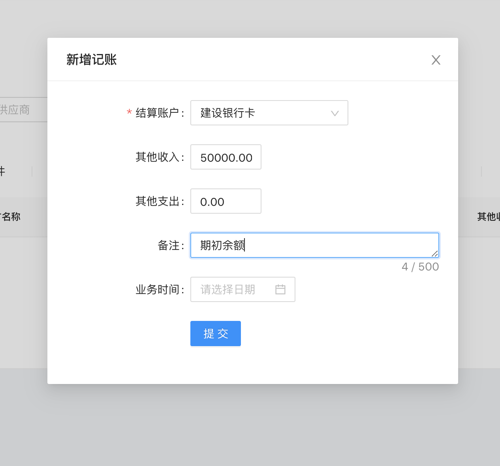
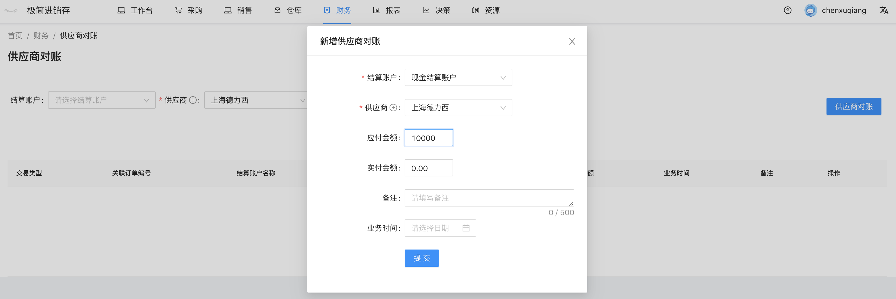
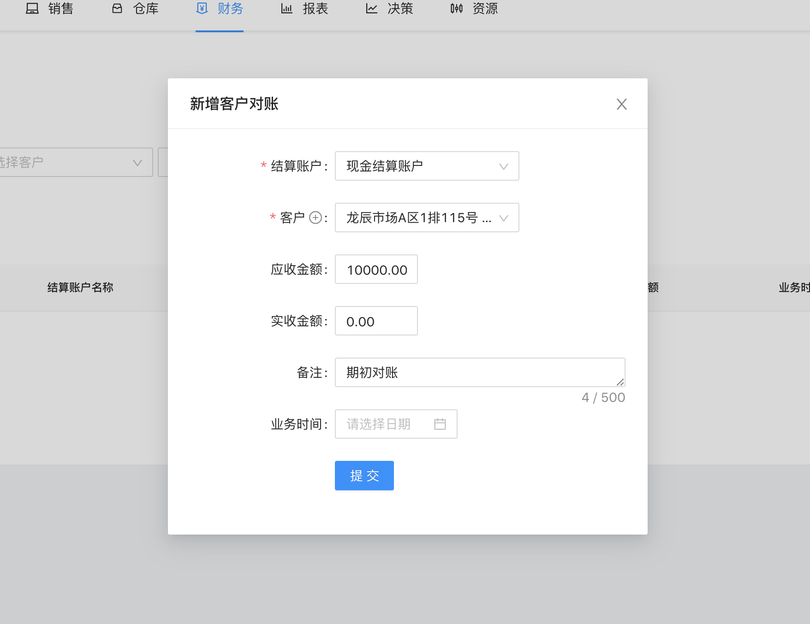

## 期初财务录入

用户在期初时，需要录入各结算账户的金额，同时也要填写供应商和客户的期初金额。

### 结算账户期初金额

`前往方式`  导航栏点击 财务 -- 账户流水

点击右上角记账，选择结算账户，填写其他收入，备注期初余额。

### 期初供应商对账

`前往方式`  导航栏点击 财务 -- 供应商对账

点击右上角供应商对账，选择结算账户，选择供应商，填写应付金额，备注期初对账。

### 期初客户对账

`前往方式`  导航栏点击 财务  -- 客户对账

点击右上角供应商对账，选择结算账户，选择供应商，填写应付金额，备注期初对账。

