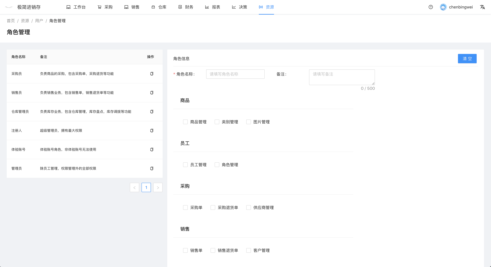

# 角色管理
功能：角色列表，新增角色。

#### 系统角色
- 采购员：负责商品的采购，包含采购单，采购退货等功能
- 销售员：负责销售业务，包含销售单，销售退货单等功能
- 仓库管理员：负责库存业务，包含仓库管理，库存盘点，库存调拨等功
- 注册人： 超级管理员，拥有最大权限
- 体验账号：体验账号角色，非体验账号无法使用
- 管理员：除员工管理，权限管理外的全部权限

#### 新增角色
系统提供的角色无法修改，用户可以新增或者复制系统角色。

通过填写角色名称，配置角色权限，完成角色添加。