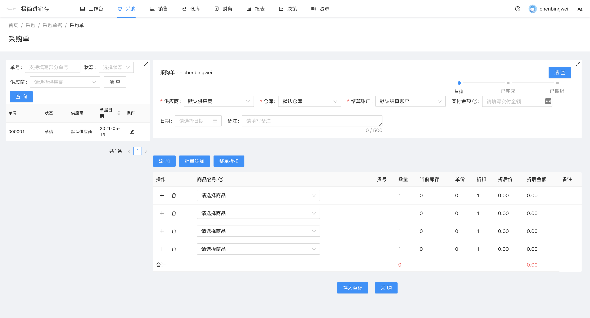
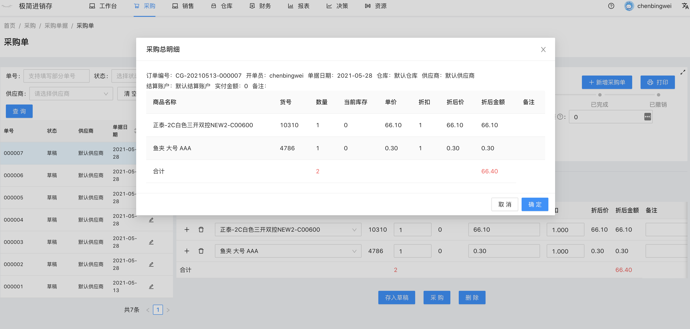
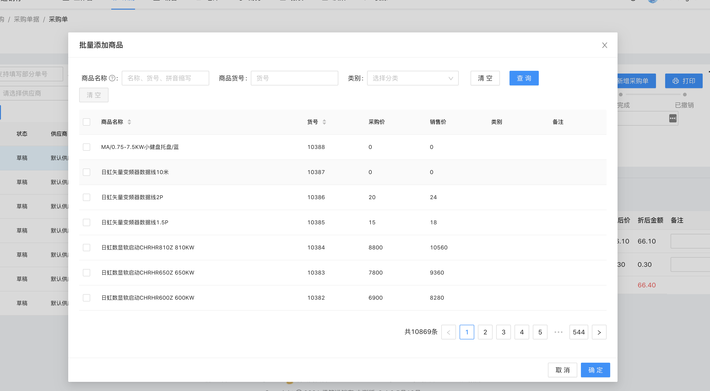

# 采购单

`前往方式` 导航栏点击 采购 -- 采购单据 -- 采购单

`功能` 采购单列表，采购单查询，新增采购单，采购单批量添加商品，采购单存入草稿，采购单入库，撤销采购单

- 页面左侧是采购单列表
- 页面右侧是采购单详情，默认为新增采购单。

### 新增采购单 
1. 选择供应商
2. 选择仓库
3. 选择结算账户
5. 添加采购商品

    点击请选择商品，出现商品下拉框，在搜索框中输入`商品名称`、`商品货号`或者`商品拼音首字母缩写`进行模糊搜索，选择需要的商品。

6. 填写商品的数量、单价、折扣和备注
7. 点击存入草稿，完成单据的保存。

### 采购单入库
1. 填入实付金额（本次付给供应商的金额）
2. 选择单据日期（采购真实发生的日期，会用于后续统计分析）
3. 点击采购，显示采购明细，点击确认，完成采购入库。 （入库时相关库存数据和财务数据发生对应修改）

## 其他功能

##### 商品批量添加
点击批量添加按钮，弹出商品列表，选择对应的商品，点击确认，商品将被添加入采购单中。

（tips: 批量添加时，鼠标双击任意商品，即可添加选择商品）

##### 商品折扣
选择供应商后，该次采购的默认折扣将于该供应商的折扣一致。
每条商品可单独设置折扣。
点击整单折扣按钮，输入对应折扣，将改变所有商品折扣。

##### 价格追踪
点击单价输入框，会显示建议采购价和该供应商上次采购价的提示，选择对应价格，完成单价填入。

##### 复制为新增
当单据完成后，会出现复制为新增按钮，点击生成相同的采购单。

##### 放大缩小

采购单列表右上角有一个放大按钮，点击放大采购单列表，显示更多筛选项和表格项。

采购单详情有上角有一个放大按钮，点击方法采购单详情操作区域，方便小屏幕操作的用户使用。

##### 撤销
当单据完成后，会出现撤销按钮，点击撤销，单据对应库存和财务数据进行回退。

##### 订单状态
单据状态分为
- `草稿` （只是保存下来，未对系统状态发送修改）
- `已完成` （商品已出库，财务已结算）
- `已撤销` （出库商品撤回，财务记录撤回）

其中草稿有多种状态
- `待处理` （编辑好等待入账）
- `报价单` （仅用于报价使用，如果报价成功，可切换为待处理或者直接点击销售）
- `在途订单` （已下单的采购单，未入库，待入库时直接点击采购）
- `废弃草稿` （用于临时保存数据）

